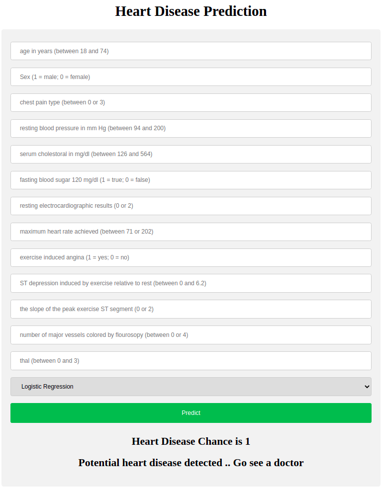

# Heart Disease Prediction App
This repository contains an example of a web application for Heart Disease prediction. The data used is available in the [Kaggle dataset - heart disease UCI](https://www.kaggle.com/ronitf/heart-disease-uci). The web application was created using Flask tested on a Docker container and deployed in Heroku. **The future work would add DVC to version the ML models.**

This exercise is divided in three steps:

1. Analysing the Heart Disease UCI dataset, building different models using the sklearn API, selecting the best model and saving this one into a .pkl file for deployment.
2. Deploying the model into the web app.
3. The third step was to Dockerized this Flask application.

